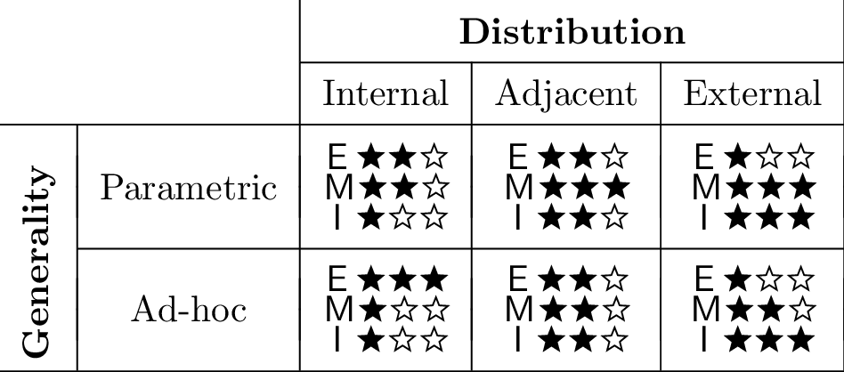

# EMI Framework



## Organization

### Original API - Publication Catalogue
```jolie
interface PubCatInterface {
  RequestResponse:
    getAuthorPubs( {authorId:string} )( Publications ),
    getConfPubs( {confId:string} )( Publications )
}
```
  - Implementation [original/pubcat.ol](original/pubcat.ol)
    ```jolie
    location: "local"
    protocol: sodep
    ```
  - TCP/HTTP Endpoint [original/http.ol](original/http.ol)
    ```jolie
    location: "socket://localhost:8080"
    protocol: http {
        "/author/{authorId}" -> getAuthorPubs( {authorId} )
        "/conf/{confId}" -> getConfPubs( {confId} )
    }
    ```
### Refactored API - Publication Catalogue with API-Key
```jolie
interface PubCatWithAPIKeyInterface {
  RequestResponse:
    getAuthorPubs( {authorId: string, key: string} )( Publications ) throws NotAuthorised,
    getConfPubs( {confId: string, key: string} )( Publications ) throws NotAuthorised
}
```
  - Ad-hoc/Internal
    - Implementation [ad-hoc/internal/pubcat.ol](ad-hoc/internal/pubcat.ol)
      ```jolie
      location: "local"
      protocol: sodep
      ```
    - TCP/HTTP Endpoint [ad-hoc/internal/http.ol](ad-hoc/internal/http.ol)
      ```jolie
      location: "socket://localhost:8080"
      protocol: http {
          Header: "Authorization: {key}"
          URI: "/author/{authorId}" -> getAuthorPubs( {authorId, key} )
          URI: "/conf/{confId}" -> getConfPubs( {confId, key} )
      }
      ```
  - Ad-hoc/Adjacent [ad-hoc/adjacent/pubcat.ol](ad-hoc/adjacent/pubcat.ol)
    TCP/HTTP Endpoint for [original/pubcat.ol](original/pubcat.ol)
    ```jolie
    location: "socket://localhost:8081"
    protocol: http {
        Header: "Authorization: {key}"
        URI: "/author/{authorId}" -> getAuthorPubs( {authorId, key} )
        URI: "/conf/{confId}" -> getConfPubs( {confId, key} )
    }
    ```
  - Ad-hoc/External [ad-hoc/external/pubcat.ol](ad-hoc/adjacent/pubcat.ol)
    TCP/HTTP Endpoint for [original/http.ol](original/http.ol)
    ```jolie
    location: "socket://localhost:8081"
    protocol: http {
        Header: "Authorization: {key}"
        URI: "/author/{authorId}" -> getAuthorPubs( {authorId, key} )
        URI: "/conf/{confId}" -> getConfPubs( {confId, key} )
    }
    ```
  - Parametric/Adjacent [parametric/adjacent/pubcat.ol](parametric/adjacent/pubcat.ol)
    TCP/HTTP Endpoint for [original/pubcat.ol](original/pubcat.ol)
    ```jolie
    location: "socket://localhost:8081"
    protocol: http {
        Header: "Authorization: {key}"
        URI: "/author/{authorId}" -> getAuthorPubs( {authorId, key} )
        URI: "/conf/{confId}" -> getConfPubs( {confId, key} )
    }
    ```
  - Parametric/External [parametric/external/pubcat.ol](external/adjacent/pubcat.ol)
    TCP/HTTP Endpoint for [original/http.ol](original/http.ol)
    ```jolie
    location: "socket://localhost:8081"
    protocol: http {
        Header: "Authorization: {key}"
        URI: "/author/{authorId}" -> getAuthorPubs( {authorId, key} )
        URI: "/conf/{confId}" -> getConfPubs( {confId, key} )
    }
    ```
### Additional patterns
- Merge Endpoints [merge-endpoints/pub-index.ol](merge-endpoints/pub-index.ol)
- Version Identifier [version-identifier/pubcat-gateway.ol](version-identifier/pubcat-gateway.ol)

## Usage

Testing each service requires `jolie`.
```bash
jolie external/adjacent/test.ol
```
